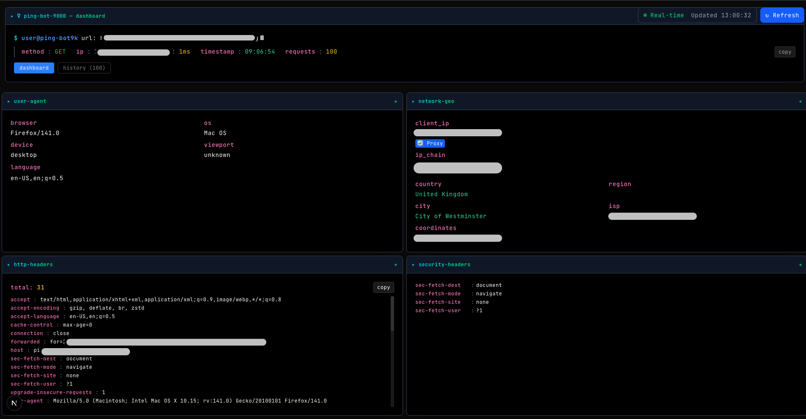

# PingBot-9000 🤖

<div align="center">
  
</div>

A simple app that shows you what your HTTP request looked like when it hit the server.

*"What... is your User-Agent?" "Mozilla/5.0 (Windows NT 10.0; Win64; x64)..." "What... is your Accept-Language?" "en-US,en;q=0.9..." "What... is the airspeed velocity of an unladen swallow?" "What do you mean? An African or European swallow?" "I don't know that!" \*gets thrown into the gorge of unhandled exceptions\**

## Features

- **Request Analysis**: Like the Spanish Inquisition, but for HTTP headers - nobody expects the X-Forwarded-For!
- **Network Information**: Client IP detection and geolocation lookup (we know where you live, approximately)
- **Security Headers**: Special focus on security-related headers - because sec-* headers are the Holy Grail of modern web development
- **Performance Tracking**: Server-side performance metrics (faster than a coconut-laden swallow)
- **Multiple Output Formats**: Both web interface and JSON API endpoints - one for humans, one for the robots who've clearly taken over
- **Request History**: Persistent storage via Supabase (because forgetting is for humans, not databases)
- **Real-time Monitoring**: Live request inspection, because watching paint dry is for amateurs

<div >
  
</div>

## Quick Start

### Prerequisites

- Node.js 18.0 or later (or we shall say "Ni!" to you)
- pnpm (recommended) or npm (the Black Knight of package managers - "'Tis but a flesh wound!")
- A Supabase project (for storing request history - because RAM is temporary but PostgreSQL is eternal)

### Installation

1. Clone the repository:
```bash
git clone <your-repository-url>
cd pingbot-9000
```

2. Install dependencies:
```bash
pnpm install
# or
npm install
```

3. Set up Supabase:
   - Create a new Supabase project at [supabase.com](https://supabase.com)
   - Set up environment variables with your Supabase credentials (use Supabase for Next; you will need `NEXT_PUBLIC_SUPABASE_URL` and `NEXT_PUBLIC_SUPABASE_PUBLISHABLE_DEFAULT_KEY` vars) in a .env.local or as environmnent variables on Vercel if deploying there. 
   - Create the request history table:
   ```sql
   CREATE TABLE request_history (
     id UUID PRIMARY KEY DEFAULT gen_random_uuid(),
     timestamp TEXT NOT NULL,
     method TEXT NOT NULL,
     url TEXT NOT NULL,
     path TEXT NOT NULL,
     client_ip TEXT,
     user_agent TEXT,
     request_data JSONB,
     created_at TIMESTAMP WITH TIME ZONE DEFAULT NOW()
   );
   ```

4. Start the development server:
```bash
pnpm dev
# or
npm run dev
```

5. Open [http://localhost:3000](http://localhost:3000) in your browser or whatever vercel url you have configd

## Usage

### Web Interface

Visit the application in your browser to see a detailed analysis of your request, including:

- Request headers and metadata (the sacred texts!)
- Client IP and geolocation information (we shall find you, and we shall... analyze you)
- Browser fingerprinting data (your browser's digital DNA, but less creepy)
- Performance metrics (because speed matters, unlike the Knights who say "Ni!")
- Security headers analysis (protecting you from the Rabbit of Caerbannog-level threats)

### JSON API

Add `?format=json` to any request or set the `Accept: application/json` header to receive response data in JSON format:

```bash
curl -H "Accept: application/json" http://localhost:3000
```

### Query Parameters

You can add any query parameters to test different scenarios:

```
http://localhost:3000?test=value&source=example
```

## Deployment

### Production Build

```bash
pnpm build
pnpm start
```

### Environment Variables

The application automatically detects deployment environments:

- `VERCEL_URL`: Automatically set on Vercel deployments
- For other platforms, ensure proper URL configuration

### Platform Support

This application is optimized for deployment on:

- Vercel (recommended)
- Netlify
- Any Node.js hosting platform

## API Reference

### GET /

Returns request analysis data

**Query Parameters:**
- `format=json` - Return JSON instead of HTML
- Any additional parameters are captured and included in the analysis

**Response (JSON):**
```json
{
  "timestamp": "2025-01-21T10:30:00.000Z",
  "method": "GET",
  "url": "https://your-domain.com",
  "path": "/",
  "query": {},
  "headers": {
    "all": {},
    "ordered": [],
    "identity": {
      "userAgent": "...",
      "acceptLanguage": "...",
      "referer": "...",
      "secHeaders": {}
    }
  },
  "network": {
    "clientIP": "1.2.3.4",
    "geolocation": {
      "country": "US",
      "region": "CA",
      "city": "San Francisco"
    }
  },
  "cookies": {},
  "performance": {
    "serverTime": 25
  }
}
```

## Technology Stack

- **Framework**: Next.js 15.5.3 with App Router
- **Runtime**: React 19.1.0
- **Styling**: Tailwind CSS 4.0
- **UI Components**: Radix UI primitives
- **Icons**: Lucide React
- **TypeScript**: Full type safety

## Project Structure

```
src/
├── app/
│   ├── api/           # API routes
│   ├── layout.tsx     # Root layout
│   └── page.tsx       # Main request inspector page
├── components/
│   ├── ui/            # Reusable UI components
│   └── request-inspector.tsx
├── lib/
│   ├── geo-lookup.ts  # Geolocation utilities
│   ├── request-parser.ts
│   └── utils.ts
└── middleware.ts      # Request tracking middleware
```

## Contributing

1. Fork the repository
2. Create your feature branch (`git checkout -b feature/amazing-feature`)
3. Commit your changes (`git commit -m 'Add some amazing feature'`)
4. Push to the branch (`git push origin feature/amazing-feature`)
5. Open a Pull Request

## Development

### Available Scripts

- `pnpm dev` - Start development server with Turbopack
- `pnpm build` - Build for production with Turbopack
- `pnpm start` - Start production server

### Adding New Features

The application is built with modularity in mind. Key areas for extension:

- **Request Analysis**: Extend `src/lib/request-parser.ts`
- **UI Components**: Add new components in `src/components/`
- **API Endpoints**: Create new routes in `src/app/api/`

## License

[MIT License](LICENSE) - feel free to use this project for any purpose.

## Support

If you encounter any issues or have questions:

1. Check the [Issues](../../issues) page
2. Create a new issue with detailed information
3. Include request examples and expected behavior

---
This tool is provided "as-is" without any warranties, express or implied. While PingBot-9000 faithfully reports what it sees in your HTTP requests, it cannot guarantee protection from the Knights who say "Ni!", killer rabbits, or unexpected Spanish Inquisitions. 

*Privacy Note*: This tool displays request information including IP addresses and headers. Only use it for requests you're comfortable analyzing.

*Security Warning*: Never send sensitive data (passwords, API keys, credit card numbers, or the location of the Holy Grail) to this endpoint. It's designed for debugging, not for keeping secrets.

Use at your own risk. Side effects may include: enlightenment about HTTP headers, existential questions about User-Agents, and an irresistible urge to quote Monty Python.